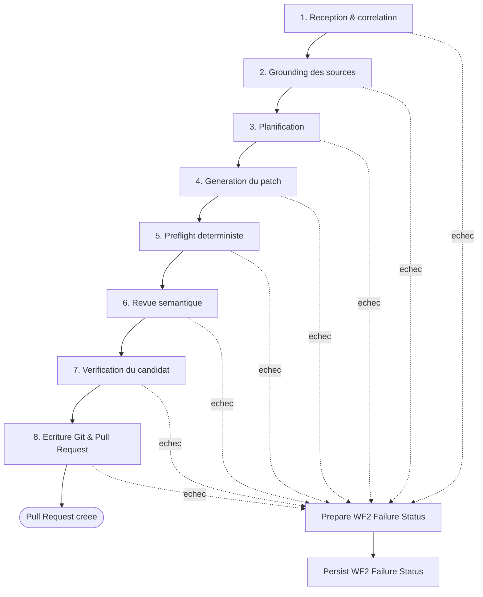

# WF2 — Git Patch & PR : comprendre et expliquer le flux

Ce document est écrit pour une personne qui doit **comprendre et expliquer** WF2 à un jury — pas pour quelqu'un qui doit le maintenir ou le modifier. Il décrit l'intention et les garanties, et donne en annexe le détail nœud par nœud pour pouvoir répondre à une question précise.

WF2 reçoit une demande de correction de code déjà autorisée (un correctif de sécurité, par exemple) et produit une Pull Request — mais seulement après avoir construit et vérifié un candidat de bout en bout. À aucun moment une IA n'écrit directement sur GitHub.

## Méthodologie de vérification de ce document

Toutes les affirmations de ce document (noms de nœuds, routage, compteurs, modèles LLM) ont été vérifiées le 2026-10-03 contre la base n8n live (copie en lecture seule de la triade `database.sqlite` + `-wal` + `-shm`, aucune écriture sur le conteneur). Le graphe lu est celui de la **version active servie** (`workflow_entity.activeVersionId`, retrouvée dans `workflow_history`), pas le brouillon de l'éditeur — au moment de la vérification, un brouillon plus récent existait déjà et divergeait de la version active (exactement le piège décrit en fin de document). Total vérifié : **186 nœuds fonctionnels + 11 sticky notes = 197**.

## Correction prioritaire — défaut identifié, conséquence prouvée, correctif préparé (R84)

Une version précédente de ce document affirmait à tort qu'un nœud nommé *"Failure Envelope - Save Execution Result"* n'avait pas de câblage sortant. **C'est inexact et a été corrigé par re-vérification directe du graphe live** : `Failure Envelope - Save Execution Result to Backend` est câblé exactement comme les autres, vers `Prepare WF2 Failure Status`.

Le graphe contient **74 Failure Envelopes**, pas 24. Je les ai toutes vérifiées individuellement, à quatre reprises sur des copies fraîches de la base :

- **73 des 74** convergeaient vers `Prepare WF2 Failure Status` → `Persist WF2 Failure Status` (callback backend).
- **1 exception réelle : `Failure Envelope - Validate Cross-File Type Coherence` n'avait aucune connexion sortante.** C'est un nœud `code` avec `onError: continueErrorOutput` — sa sortie 1 est une vraie sortie d'erreur, pas une branche métier — et son origine est datée : commit `5f33dfc` (2026-09-19, `harden-wf2-plan-authority-type-coherence.mjs`), qui câble correctement l'entrée de l'enveloppe mais oublie sa sortie. Ni le test associé (`wf2-cross-file-type-coherence.spec.mjs`) ni le sticky note du canvas (qui affirmait à tort "74... convergent") n'avaient détecté le trou.

**Conséquence vérifiée dans le code backend, pas supposée** : une erreur réelle sur `Validate Cross-File Type Coherence` (chemin multi-fichiers) est interceptée par n8n (pas de crash, pas d'`errorWorkflow` déclenché), construit son JSON d'échec dans l'enveloppe, puis n'a plus de nœud suivant. Le webhook WF2 répond en `onReceived` (avant même l'exécution), donc l'appelant n'apprend rien. Le backend (`incidents.service.ts`) ne lit que le statut HTTP de l'appel de dispatch, jamais le résultat, et pose l'incident en `DISPATCHED` en attendant un callback qui n'arrivera jamais. Le seul rattrapage existant, `reconcileStaleDispatch()`, n'est accessible que par un appel HTTP explicite d'un administrateur (aucun cron, aucun bouton frontend) : **l'incident reste bloqué en `DISPATCHED`, indéfiniment, sans trace ni relance automatique** — exactement le défaut systémique que cette architecture est censée empêcher.

**Correctif (R84, préparé le 2026-10-03, voir `n8n-workflows/scripts/harden-wf2-wire-type-coherence-failure-envelope.mjs` + sa spec) :** la connexion manquante a été ajoutée, identique dans sa forme aux 73 autres. La spec associée fait désormais partie des garde-fous du dépôt : elle vérifie par le code, pour les 74 enveloppes nommément, que chacune converge vers `Prepare WF2 Failure Status` — cette régression précise ne peut plus revenir sans faire échouer la spec. **État au moment de la rédaction : correctif vérifié et prêt (artefact + spec + backup horodaté avec SHA-256 avant/après), promotion en production pas encore effectuée.** L'invariant « tout échec rappelle le backend » est donc **vrai à 74/74 une fois ce correctif promu** ; tant que la promotion n'a pas eu lieu, le graphe réellement servi reste à 73/74 et l'exception ci-dessus s'applique encore.

Je n'ai pas cherché à vérifier à la main les 73 autres cibles une par une au-delà de ce contrôle automatique sur le graphe — la vérification porte sur la présence et la destination de chaque connexion sortante, pas sur le contenu exact transporté par chacune.

---

## 1. Contrat par bloc

Pour chaque bloc : ce qu'il reçoit, ce qu'il produit, ce qu'il garantit, ce qui se passe s'il échoue, et son nombre de nœuds **vérifié** sur le graphe live (entre parenthèses, l'ancien chiffre approximatif quand il diffère).

### Bloc 1 — Réception & corrélation (14 nœuds, + 1 sortie de policy)

| | |
|---|---|
| **Reçoit** | Le payload webhook brut (`incidentId`, dépôt, branche de remédiation souhaitée, findings approuvés) |
| **Produit** | Un `correlationEnvelope` figé + la confirmation que la branche de remédiation existe (SHA de tête) ou vient d'être créée, + la SHA de la branche principale |
| **Garantit** | Qu'aucune étape suivante ne travaille sur une identité ambiguë ou une branche mouvante ; qu'un correctif non autorisé par la politique de dépôt est rejeté *avant* toute lecture de code |
| **S'il échoue** | Chaque nœud a sa propre Failure Envelope dédiée (ex. `Failure Envelope - Policy Gate - Validate Constraints`) ; le rejet de politique a sa propre branche terminale `Return Policy Rejected` → `Failure Envelope - Return Policy Rejected` |
| **Nœuds** | 14 en chaîne nominale (`Webhook → Capture Correlation Envelope → Adapt Webhook Payload → Fetch Repository Metadata → Apply Repository Metadata → Policy Gate - Validate Constraints → Patch Allowed? →` [vrai] `Get Main Branch SHA1 → Prepare Batch Context → Lookup Remediation Branch → Branch Exists? →` [existe] `Use Existing Branch` / [n'existe pas] `Record New Branch Baseline → Fetch Repository Tree`) + 1 sortie de rejet (`Return Policy Rejected`). Le document précédent indiquait "15 nœuds" — cohérent si on compte la sortie de rejet dans le total. |

### Bloc 2 — Grounding des sources (4 nœuds core + 5 en extension)

| | |
|---|---|
| **Reçoit** | L'arborescence du dépôt + le(s) fichier(s) identifié(s) par le finding |
| **Produit** | Le contenu réel du/des fichier(s) source(s), des fichiers API référencés et des dépendances nécessaires à la génération |
| **Garantit** | Que la génération ne travaillera jamais sur une hypothèse : chaque octet de contexte vient d'une lecture GitHub réelle au SHA figé en bloc 1 |
| **S'il échoue** | FE dédiée pour `Build Independent Repository Policy`, `Expand Finding Source Files`, `Fetch Finding Source Context`, `Expand Referenced API Sources`. **Exception vérifiée** : les 2 nœuds `Fetch Referenced API Sources` et `Fetch Required Dependency Sources` continuent vers l'étape suivante *que la lecture GitHub réussisse ou échoue* (sortie succès et sortie erreur routées vers la même cible) — un fichier référencé manquant est traité comme "contexte optionnel absent", pas comme un échec bloquant. Et `Validate Source Context Completeness`, `Expand Required Dependency Sources`, `Validate Required Dependency Sources` n'ont **pas** de Failure Envelope dédiée : leur sortie d'erreur est routée vers l'enveloppe `Failure Envelope - Fetch Referenced API Sources`, qui existe déjà pour un autre nœud. Le statut persisté en cas d'échec de l'un de ces trois nœuds porterait donc `failedNode: "Fetch Referenced API Sources"` même si le nœud réellement en échec est un autre — un détail de diagnostic imprécis, pas un défaut d'invariant (le callback a toujours lieu). |
| **Nœuds** | Core (4) : `Build Independent Repository Policy, Expand Finding Source Files, Fetch Finding Source Context, Validate Source Context Completeness`. Extension sources référencées/dépendances (5, exécutée entre les deux derniers nœuds core malgré la numérotation) : `Expand Referenced API Sources, Fetch Referenced API Sources, Expand Required Dependency Sources, Fetch Required Dependency Sources, Validate Required Dependency Sources`. |

### Bloc 3 — Planification (3 nœuds)

| | |
|---|---|
| **Reçoit** | Le contexte source complet du bloc 2 + les findings approuvés |
| **Produit** | Un plan de remédiation structuré (fichiers à toucher, opération CREATE/MODIFY, changements requis/interdits) |
| **Garantit** | Que "quoi faire" est validé structurellement avant que "comment le faire" ne soit généré |
| **S'il échoue** | `Failure Envelope - Prepare Generic Remediation Plan`, `Failure Envelope - Generate Remediation Plan`, `Failure Envelope - Validate Generic Remediation Plan` |
| **Nœuds** | `Prepare Generic Remediation Plan → Generate Remediation Plan (appel LLM, claude-sonnet-5) → Validate Generic Remediation Plan`. Le document précédent indiquait "4 nœuds" — je n'en trouve que 3 dans la chaîne de planification elle-même ; le 4ᵉ nœud qu'il comptait probablement (`Route Planned File Operation`) appartient structurellement à la boucle du bloc 4 ci-dessous. |

### Bloc 4 — Génération du patch (10 nœuds, Boucle A)

| | |
|---|---|
| **Reçoit** | Le plan validé, un fichier planifié à la fois |
| **Produit** | Un candidat de patch par fichier (code patché + hash SHA-256 du contenu), puis le manifeste agrégé de tous les fichiers du lot |
| **Garantit** | Que chaque patch est généré à partir du contenu source réellement lu (bloc 2), jamais d'une supposition ; que la génération ne se termine que lorsque *tous* les fichiers planifiés ont un candidat |
| **S'il échoue** | FE dédiée par nœud (`Failure Envelope - Prepare - Code Patch Body`, `Failure Envelope - de Patch - HTTP Request`, etc.) |
| **Nœuds** | C'est une boucle (`splitInBatches`, voir section Boucles) : `Merge Effective File Results` (contrôle de boucle) → par fichier : `Route Planned File Operation` (if : CREATE ?) → [nouveau] `Seed New Planned File` / [existant] `Fetch Repository Files` → `Prepare - Code Patch Body` → `de Patch - HTTP Request` (appel LLM, **claude-opus-5**) → `Parse - Code Patch Output` → `Hash Candidate File Content` → `Accumulate Candidate File` → (une fois tous les fichiers traités) `Prepare Candidate Manifest`. Le document précédent indiquait "5 nœuds" ; le chiffre réel est plus élevé car il inclut le contrôle de boucle et l'assemblage du manifeste. |

### Bloc 5 — Preflight déterministe (1 nœud)

| | |
|---|---|
| **Reçoit** | Un candidat de patch (code original + code patché) |
| **Produit** | Soit une confirmation `genericPreflightPassed: true` + le corps de requête LLM pour la revue (bloc 6), soit une exception bloquante |
| **Garantit** | Sans aucun LLM : périmètre de fichier autorisé, opération CREATE/MODIFY cohérente avec l'état réel du dépôt, changement non vide et non identique à l'original, absence de secret en dur, de suppression de règle d'analyse statique introduite par le patch, de marqueur TODO/FIXME introduit, de cast brut non gardé par `instanceof`, de structure lexicale déséquilibrée (accolades/parenthèses/chaînes) |
| **S'il échoue** | `Failure Envelope - Generic Candidate Preflight`, avec le détail des violations dans le message (ex. `WF2_CANDIDATE_QUALITY_REJECTED`) |
| **Nœuds** | `Generic Candidate Preflight`. Confirmé exact : **1 seul nœud**, et confirmé 100% déterministe pour ses propres contrôles — mais ce même nœud **construit aussi** le corps de la requête LLM que le bloc 6 enverra (modèle, system prompt, données). Le preflight ne décide donc pas lui-même d'appeler un LLM ; il prépare l'appel que le bloc suivant exécutera. |

### Bloc 6 — Revue sémantique mono-fichier (2 nœuds)

| | |
|---|---|
| **Reçoit** | Le corps de requête LLM préparé par le bloc 5 (candidat + plan + contexte source + preuves de preflight) |
| **Produit** | Un verdict `ACCEPTABLE_FOR_SCANNER_VALIDATION`, `REJECTED` ou `INCONCLUSIVE` + une liste de findings structurés |
| **Garantit** | Que la revue est menée par un **modèle différent** de celui qui a généré le patch (`claude-haiku-4-5-20251001` ici, contre `claude-opus-5` en génération) — ce n'est pas qu'un "second appel", c'est un modèle distinct, avec un system prompt qui s'auto-désigne "indépendant du générateur". Le résultat ne peut jamais, seul, s'écrire sur GitHub — l'enforcement (`Enforce Independent Review`) rejette toujours un verdict `REJECTED` sans recours |
| **S'il échoue** | `Failure Envelope - Independent Semantic Review`, `Failure Envelope - Enforce Independent Review` |
| **Nœuds** | `Independent Semantic Review` (appel LLM) → `Enforce Independent Review`. S'applique uniquement si `Classify Candidate Coordination Scope` route vers le chemin mono-fichier (moins de 2 fichiers dans le candidat) ; sinon c'est l'extension multi-fichiers (ci-dessous) qui prend le relais. |

### Extension — Vérification cross-fichiers (16 nœuds, déclenchée si ≥ 2 fichiers)

Déclenchée par `Classify Candidate Coordination Scope` (condition vérifiée : `files.length >= 2`). Rejoue une compilation, les tests, et une revue sémantique dédiée au lot complet : `Hash Cross-File Candidate Manifest, Validate Cross-File Candidate Manifest, Validate Cross-File Type Coherence, Prepare/Call/Enforce Cross-File COMPILE_MAIN, Prepare/Call/Enforce Cross-File COMPILE_TESTS, Prepare/Call/Enforce Cross-File FULL_TEST, Prepare Cross-File Review, Independent Cross-File Semantic Review (LLM, claude-haiku-4-5), Enforce Cross-File Review`. Les deux chemins (mono et multi-fichiers) reconvergent ensuite au bloc 7 via `Hash Candidate Manifest`. Le document précédent indiquait "22 nœuds" pour cette extension ; je vérifie **16** pour la partie cross-fichiers proprement dite. En y ajoutant les 5 nœuds de l'extension de grounding du bloc 2 (qui relisent eux aussi des fichiers liés), le total des deux extensions combinées est **21**, proche du chiffre précédent sans le reproduire exactement.

### Bloc 7 — Vérification du candidat (11 nœuds)

| | |
|---|---|
| **Reçoit** | Le manifeste complet (mono ou multi-fichiers), haché |
| **Produit** | Une confirmation `ok: true` de vérification + de garde d'écriture + d'absence de dérive de branche distante |
| **Garantit** | Par calcul, pas par confiance : le candidat vérifié par le backend (`/api/candidate-verification/verify`) correspond exactement au manifeste proposé ; la branche cible n'a pas bougé depuis la lecture initiale (`Write Guard`, puis une seconde vérification de dérive dédiée) |
| **S'il échoue** | `Write Guard Passed?` faux → `Persist Verification Failure` (gestionnaire dédié, pas une FE générique) ; `Remote Head Drift Passed?` faux → `Persist Base Moved Failure` (idem) ; sinon FE standard par nœud |
| **Nœuds** | `Hash Candidate Manifest → Assemble Candidate Manifest → Call Candidate Verification → Call Write Guard → Write Guard Passed? → Branch Existed At Generation? →` [existait] `Re-check Existing Branch Head` / [n'existait pas] `Re-lookup Baseline Ref Before Creation →` (reconvergent) `Call Remote Head Drift Guard → Remote Head Drift Passed? → Branch Existed At Generation? (Pass 2 Entry)`. Le document précédent indiquait "32 nœuds" ; cela ne se vérifie que si on y inclut l'extension cross-fichiers (16) sans que le total recolle exactement (11+16=27). Je rapporte le chiffre du noyau partagé isolément. |

### Bloc 8 — Écriture Git & Pull Request (30 nœuds, Boucle B)

| | |
|---|---|
| **Reçoit** | Le candidat vérifié, fichier par fichier |
| **Produit** | Soit une Pull Request créée/mise à jour, soit un échec explicite |
| **Garantit** | Recalcul + comparaison du hash juste avant écriture (`Verify Content Hash Before Send`) ; relecture immédiate après écriture et réconciliation en cas d'écriture concurrente (`Pass 2`) ; **tous** les fichiers planifiés doivent être présents (`Validate Batch Completeness`) avant toute création de PR — un seul fichier manquant ou en échec bloque la PR entière |
| **S'il échoue** | FE standard par nœud ; pour l'écriture GitHub elle-même, un chemin dédié de classification/réconciliation avant de conclure à un échec (voir ci-dessous) |
| **Nœuds** | Boucle B (`Loop Over Manifest Files`) : par fichier, `Recompute Content Hash Before Send → Verify Content Hash Before Send → Candidate Creates File? →` [créer] `Create File in Branch` / [modifier] `Update File in Branch` → `Build File Result (Pass 2)` → (si écriture en échec côté Update) `Classify GitHub Write Error (Pass 2) → Transport Requires Read Back? (Pass 2) →` [oui] `Read Back File After Write Error (Pass 2) → Decode Reconciled Remote Content → Hash Reconciled Remote Content → Evaluate GitHub Write Reconciliation (Pass 2) → Remote Candidate Present? (Pass 2) → Lookup Head After Reconciled Write (Pass 2) → Build Reconciled File Result` → `Merge Effective File Results 2` → (fin de boucle) `Validate Batch Completeness → Lookup Existing Batch PR → Select Existing PR → Existing PR? →` [oui] `Use Existing PR` / [non] `Create Pull Request1` → `Save Execution Result to Backend → If →` (si décision = `FIX_PROPOSED`) `Send an Email`. Branche de création de branche manquante avant la boucle : `Re-lookup Remediation Branch Before Create → Prepare Branch Creation → Create Missing Branch → Expand Manifest Files`. Le document précédent indiquait "19 nœuds" ; je vérifie 30 en incluant la sous-chaîne de réconciliation Pass 2, qui ne s'active que sur conflit d'écriture. |

---

## 2. Patron commun des 74 Failure Envelopes

Toutes les Failure Envelopes partagent **un code identique**, à l'exception du littéral `failedNode`. Chacune :

1. récupère l'erreur ou l'item d'entrée tel que reçu de son nœud d'origine ;
2. en extrait un message, **expurge** tout motif ressemblant à `token=`, `password=`, `secret=`, `authorization=` (remplacé par `[REDACTED]`), et le tronque à 500 caractères ;
3. tente d'extraire un code en `MAJUSCULES_SOULIGNÉES` en tête du message (ex. `WF2_PATCH_SCOPE_VIOLATION`), sinon retombe sur `WF2_EXECUTION_ERROR` ;
4. va rechercher le `correlationEnvelope` capturé tout au début du flux (`$items('Capture Correlation Envelope', 0, 0)`), pour garantir que l'incident est toujours identifiable même si l'échec survient très loin dans le graphe ;
5. retourne `{correlationEnvelope, executionId, failedNode, failureCode, failureSummary}`.

La liste complète (74, triée) : Accumulate Candidate File, Adapt Webhook Payload, Apply Repository Metadata, Assemble Candidate Manifest, Build File Result, Build File Result (Pass 2), Build Independent Repository Policy, Build Reconciled File Result, Call Candidate Verification, Call Cross-File COMPILE_MAIN, Call Cross-File COMPILE_TESTS, Call Cross-File FULL_TEST, Call Remote Head Drift Guard, Call Write Guard, Capture Correlation Envelope, Create File in Branch, Create Missing Branch, Create Pull Request1, Enforce Cross-File COMPILE_MAIN, Enforce Cross-File COMPILE_TESTS, Enforce Cross-File FULL_TEST, Enforce Cross-File Review, Enforce Independent Review, Evaluate GitHub Write Reconciliation, Expand Finding Source Files, Expand Manifest Files, Expand Referenced API Sources, Fetch Finding Source Context, Fetch Referenced API Sources, Fetch Repository Files, Fetch Repository Metadata, Fetch Repository Tree, Generate Remediation Plan, Generic Candidate Preflight, Get Main Branch SHA1, Hash Cross-File Candidate Manifest, Independent Cross-File Semantic Review, Independent Semantic Review, Lookup Existing Batch PR, Lookup Head After Reconciled Write, Lookup Head After Reconciled Write (Pass 2), Lookup Remediation Branch, Parse - Code Patch Output, Policy Gate - Validate Constraints, Prepare - Code Patch Body, Prepare Batch Context, Prepare Branch Creation, Prepare Cross-File COMPILE_MAIN, Prepare Cross-File COMPILE_TESTS, Prepare Cross-File FULL_TEST, Prepare Cross-File Review, Prepare Generic Remediation Plan, Re-check Existing Branch Head, Re-lookup Baseline Ref Before Creation, Re-lookup Remediation Branch Before Create, Read Back File After Write Error, Read Back File After Write Error (Pass 2), Record New Branch Baseline, Remote Candidate Present?, Remote Candidate Present? (Pass 2), Return Policy Rejected, Save Execution Result to Backend, Seed New Planned File, Select Existing PR, Transport Requires Read Back?, Transport Requires Read Back? (Pass 2), Use Existing Branch, Use Existing PR, Validate Batch Completeness, Validate Cross-File Candidate Manifest, Validate Cross-File Type Coherence, Validate Generic Remediation Plan, Verify Content Hash Before Send, de Patch - HTTP Request.

**Deux gestionnaires dédiés** (hors du patron FE générique, car ils portent un code métier spécifique plutôt qu'un simple relais) : `Persist Verification Failure` (garde d'écriture refusée), `Persist Base Moved Failure` (dérive de branche distante détectée).

---

## 3. Boucles, appels LLM et autres mécanismes transversaux

### Boucles

- **Boucle A — génération par fichier** (`splitInBatches` nommé `Merge Effective File Results`). Sortie "fin de lot" → `Prepare Candidate Manifest` (assemblage une fois tous les fichiers traités). Sortie "boucle" → `Route Planned File Operation` (traite le fichier suivant).
- **Boucle B — écriture par fichier** (`splitInBatches` nommé `Loop Over Manifest Files`). Sortie "fin de lot" → `Validate Batch Completeness`. Sortie "boucle" → `Recompute Content Hash Before Send` ; après écriture et construction du résultat, `Merge Effective File Results 2` (nœud `noOp`) renvoie explicitement vers `Loop Over Manifest Files` pour le fichier suivant.

### Appels LLM — 4 au total, tous en HTTP direct vers `api.anthropic.com/v1/messages` (aucun nœud IA n8n)

| Nœud | Modèle | Rôle |
|---|---|---|
| `Generate Remediation Plan` | claude-sonnet-5 | Propose le plan de remédiation (bloc 3) |
| `de Patch - HTTP Request` | **claude-opus-5** | Génère le patch candidat (bloc 4) |
| `Independent Semantic Review` | **claude-haiku-4-5-20251001** | Revue indépendante mono-fichier (bloc 6) |
| `Independent Cross-File Semantic Review` | claude-haiku-4-5-20251001 | Revue indépendante multi-fichiers (extension) |

Le modèle de revue (haiku) est bien **distinct** du modèle de génération (opus) — l'indépendance revendiquée par le document n'est donc pas qu'une question de contexte de conversation séparé, c'est un modèle différent. Chaque appel voit sa réponse diagnostiquée (`model: response?.model || '<attendu>'`) à titre de log, sans toutefois faire échouer l'exécution si le champ est absent — ce n'est pas une garde dure.

### Points de hachage SHA-256 (5 nœuds `crypto`)

`Hash Candidate File Content` (contenu patché, par fichier) → `Hash Cross-File Candidate Manifest` / `Hash Candidate Manifest` (JSON canonique du manifeste, mono ou multi-fichiers) → `Recompute Content Hash Before Send` (juste avant écriture, comparé par `Verify Content Hash Before Send`) → `Hash Reconciled Remote Content` (contenu relu après un conflit d'écriture, pour comparaison lors de la réconciliation Pass 2).

### Répartition par type de nœud (186 fonctionnels)

125 `code`, 27 `httpRequest`, 15 `if`, 8 `github`, 5 `crypto`, 2 `splitInBatches`, 1 `aggregate`, 1 `webhook`, 1 `emailSend`, 1 `noOp`.

---

## 4. Nœuds morts ou non câblés — 17 nœuds, vérifiés deux fois

**Important : ce chiffre corrige celui de la vérification précédente (4 nœuds), qui ne couvrait qu'un sous-ensemble.** Un nœud est compté ici s'il n'a strictement aucune connexion entrante (racine orpheline) ou si sa seule racine d'accès est elle-même orpheline.

**Cluster 1 — jamais câblé, 4 nœuds** (confirmé par le sticky note du canvas lui-même : *"4 nœuds historiquement non câblés (Collect File Updates et consorts)"*) : `Collect File Updates`, `Log Fetch Error`, `Persist File Update Failure`, `Persist PR Creation Failure`. Aucune entrée, aucune sortie utilisée — vestiges reconnus comme tels par l'auteur.

**Cluster 2 — chaîne dupliquée morte, 13 nœuds, non documentée ailleurs** : `Build File Result`, `Classify GitHub Write Error`, `Transport Requires Read Back?`, `Read Back File After Write Error`, `Evaluate GitHub Write Reconciliation`, `Remote Candidate Present?`, `Lookup Head After Reconciled Write`, et leurs 6 Failure Envelopes associées (`Failure Envelope - Build File Result`, `- Transport Requires Read Back?`, `- Read Back File After Write Error`, `- Evaluate GitHub Write Reconciliation`, `- Remote Candidate Present?`, `- Lookup Head After Reconciled Write`). C'est une **copie structurelle exacte** de la chaîne de réconciliation `(Pass 2)` qui, elle, est vivante (`Build File Result (Pass 2)`, `Classify GitHub Write Error (Pass 2)`, etc.) — vraisemblablement un reliquat d'une ancienne version à une seule passe, non supprimé lors de l'introduction du Pass 2. Racine de l'îlot : `Classify GitHub Write Error` n'a elle-même aucune entrée ; tout le reste de la chaîne n'est accessible que depuis elle.

Total : 186 nœuds fonctionnels = **96 nominaux** (blocs 1-8 + extensions) + **73 de gestion d'échec/statut** (68 FE vivantes + `Return Policy Rejected` + `Persist Verification Failure` + `Persist Base Moved Failure` + `Prepare WF2 Failure Status` + `Persist WF2 Failure Status`) + **17 morts**.

---

## 5. Alignement canvas ↔ document

Les 11 sticky notes du canvas ne correspondent **pas** aux 8 blocs de ce document : elles encodent une réorganisation visuelle plus récente en 3 "Zones" + 2 "Boucles" + 1 zone d'échecs, avec des renvois explicites ("fusionne dans la Zone X") qui font qu'il y a aussi 5 sticky notes vides, de simples pointeurs vers une autre. Table de correspondance pour lire le canvas en suivant ce document :

| Sticky note (nom interne du nœud canvas) | Contenu réel du sticky | Blocs de ce document |
|---|---|---|
| `Sticky - Phase 1a - Reception & correlation` | "Zone 1" (34 nœuds) : réception, corrélation, résolution de branche, grounding, planification | Blocs 1 + 2 (+ extension grounding) + 3 |
| `Sticky - Phase 1b`, `Phase 2`, `Phase 3`, `Phase 8` | Vides, renvoient vers Zone 1 ou 2 | — |
| `Sticky - Phase 4 - Generation du patch` | "Boucle A" (10 nœuds) | Bloc 4 |
| `Sticky - Phase 5 - Preflight deterministe` | **Nom trompeur** : contenu réel = "Boucle B — réconciliation d'écriture Pass 2" (17 nœuds) | Bloc 8 (partie boucle) |
| `Sticky - Phase 6 - Revue semantique` | **Nom trompeur** : contenu réel = "Chemins d'échec" (toutes les FE + gestionnaires dédiés + les 4 nœuds morts du cluster 1) | Section 2 et 4 de ce document |
| `Sticky - Phase 7 - Verification du candidat` | "Zone 2" (34 nœuds) : hash/vérification candidat, revue indépendante, vérification cross-fichiers | Blocs 5, 6, 7 + extension cross-fichiers |
| `Sticky - Phase 8b - Ecriture Git & PR (suite)` | "Zone 3" (9 nœuds) : écriture, reconciliation, PR | Partie non-boucle du bloc 8 |
| `Sticky - Phase 9` | Vide, renvoie vers Zone 2 | — |

Point d'attention pour la démonstration en direct : si on ouvre le nœud n8n nommé *"Sticky - Phase 5"*, son **titre** affiché dit "Preflight déterministe" mais son **contenu** parle de la boucle d'écriture Pass 2 — ne pas lire le nom du nœud dans le panneau de propriétés comme s'il décrivait le contenu.

---

## 6. Schéma d'ensemble

## Le fil rouge

**L'IA propose ; les outils déterministes prouvent.**

| L'IA fait | Les contrôles déterministes prouvent |
|---|---|
| Propose un plan de remédiation | Corrélation, politique de dépôt, périmètre |
| Génère le candidat | Complétude des sources, manifeste, hashes |
| Effectue une revue sémantique (modèle différent du générateur) | Vérification indépendante du candidat |
| | Garde d'écriture, dérive de branche |
| | Build / tests (cas multi-fichiers) |
| | Lecture après écriture, réconciliation |
| | Autorisation de créer la Pull Request |

L'IA n'a, à aucun moment, l'autorité finale d'écrire sur GitHub.

## Les questions qu'un jury posera

**Q1. Pourquoi 186 nœuds ?**
Parce que chaque garde de sécurité (corrélation, politique, complétude des sources, hash, vérification indépendante, garde d'écriture, détection de dérive, réconciliation après écriture) est un nœud explicite et auditable séparément. Note honnête : 17 de ces 186 sont des vestiges morts (vérifiés, deux clusters identifiés), pas de la complexité utile — s'il vous demande "tout est-il utilisé ?", la réponse exacte est "non, et voici précisément quoi et pourquoi" plutôt qu'une affirmation non vérifiée.

**Q2. Comment être sûr que l'IA ne casse rien ?**
Elle ne décide jamais seule : son plan est validé, son patch passe un preflight mécanique, une **seconde IA utilisant un modèle différent** (haiku contre opus) le revoit, et le candidat final est vérifié par hash avant toute écriture.

**Q3. Que se passe-t-il si la génération est mauvaise ?**
Interceptée par le preflight déterministe (bloc 5), la revue sémantique indépendante (bloc 6), ou la vérification du candidat (bloc 7). Une fois le correctif R84 promu (voir section "Correction prioritaire"), les 74 familles d'échec possibles se terminent toutes sur un statut explicite persisté côté backend — avant ce correctif, une seule (`Validate Cross-File Type Coherence`, chemin multi-fichiers) laissait l'incident bloqué en `DISPATCHED` sans callback.

**Q4. Pourquoi pas de merge automatique ?**
La preuve que WF2 produit porte sur la génération et l'écriture du candidat, pas sur son impact dans le reste du projet. WF2 s'arrête volontairement à la Pull Request.

**Q5. Qu'est-ce qui empêche un patch invalide d'arriver en PR ?**
Trois barrières cumulatives : preflight déterministe, revue sémantique à modèle indépendant, vérification du candidat par hash juste avant écriture — plus une relecture de ce qui a été réellement écrit sur GitHub avant de considérer la PR comme valide.

**Q6. Tous les appels à l'IA utilisent-ils le même modèle ?**
Non — 3 modèles différents sur 4 appels : claude-sonnet-5 pour planifier, claude-opus-5 pour générer le patch, claude-haiku-4-5 pour les deux revues indépendantes (mono et multi-fichiers). Le choix d'un modèle plus léger pour la revue n'est pas un hasard : c'est un juge, pas un générateur, et il doit être indépendant du modèle qui a produit ce qu'il juge.

---

## Note sur l'extension multi-fichiers

Quand un correctif touche des fichiers liés entre eux, deux mécanismes complémentaires s'activent : (1) en phase de grounding, 5 nœuds relisent les sources API référencées et les dépendances requises ; (2) après génération, 16 nœuds rejouent une compilation, les tests, et une revue sémantique dédiée au lot complet avant d'accepter le candidat multi-fichiers (déclenchement : `Classify Candidate Coordination Scope`, condition `files.length >= 2`). Visuellement, cette extension vit dans sa propre zone du canevas ("Zone 2").

## Limite de gouvernance n8n

Cette instance n8n distingue le **brouillon de l'éditeur** (ce qui s'affiche et s'édite dans l'interface) de la **version publiée active** (ce qui s'exécute réellement en production). Concrètement :
- le brouillon peut diverger de la version publiée sans qu'aucune alerte ne le signale dans l'interface ;
- une modification faite dans l'éditeur n'est pas automatiquement republiée — elle reste un brouillon jusqu'à une action de publication explicite ;
- l'intention d'une modification faite dans l'éditeur n'est pas toujours traçable depuis le dépôt Git seul, puisqu'elle peut n'y avoir jamais été exportée.

Ce piège a été rencontré concrètement sur WF2 à deux reprises : une fois avec une arête d'erreur étrangère apparue dans le brouillon sans promotion explicative, et une seconde fois pendant la vérification de ce document même (un brouillon plus récent que la version active existait au moment de la relecture — c'est la version active, servie en production, qui a été utilisée comme source de vérité ici). Recommandation avant toute future promotion : (1) exporter la version active publiée, (2) exporter le brouillon courant, (3) comparer les deux, (4) comparer avec l'artefact Git attendu, (5) calculer un SHA-256, (6) expliquer toute dérive trouvée, (7) ne promouvoir qu'après cette validation.

---

## Annexe navigable — 186 nœuds fonctionnels, groupés par bloc

### Bloc 1 — Réception & corrélation (14 + 1 sortie)
Webhook (webhook) · Capture Correlation Envelope (code) · Adapt Webhook Payload (code) · Fetch Repository Metadata (httpRequest) · Apply Repository Metadata (code) · Policy Gate - Validate Constraints (code) · Patch Allowed? (if) · Return Policy Rejected (code) · Get Main Branch SHA1 (httpRequest) · Prepare Batch Context (code) · Lookup Remediation Branch (httpRequest) · Branch Exists? (if) · Use Existing Branch (code) · Record New Branch Baseline (code) · Fetch Repository Tree (httpRequest)

### Bloc 2 — Grounding des sources (4 core + 5 extension)
Build Independent Repository Policy (code) · Expand Finding Source Files (code) · Fetch Finding Source Context (github) · Expand Referenced API Sources (code) · Fetch Referenced API Sources (github) · Validate Source Context Completeness (code) · Expand Required Dependency Sources (code) · Fetch Required Dependency Sources (github) · Validate Required Dependency Sources (code)

### Bloc 3 — Planification (3)
Prepare Generic Remediation Plan (code) · Generate Remediation Plan (httpRequest, LLM) · Validate Generic Remediation Plan (code)

### Bloc 4 — Génération du patch, Boucle A (10)
Merge Effective File Results (splitInBatches) · Route Planned File Operation (if) · Seed New Planned File (code) · Fetch Repository Files (github) · Prepare - Code Patch Body (code) · de Patch - HTTP Request (httpRequest, LLM) · Parse - Code Patch Output (code) · Hash Candidate File Content (crypto) · Accumulate Candidate File (code) · Prepare Candidate Manifest (code)

### Bloc 5 — Preflight déterministe (1)
Generic Candidate Preflight (code)

### Bloc 6 — Revue sémantique mono-fichier (2)
Independent Semantic Review (httpRequest, LLM) · Enforce Independent Review (code)

### Extension — Vérification cross-fichiers (16)
Classify Candidate Coordination Scope (if) · Hash Cross-File Candidate Manifest (crypto) · Validate Cross-File Candidate Manifest (code) · Validate Cross-File Type Coherence (code) · Prepare Cross-File COMPILE_MAIN (code) · Call Cross-File COMPILE_MAIN (httpRequest) · Enforce Cross-File COMPILE_MAIN (code) · Prepare Cross-File COMPILE_TESTS (code) · Call Cross-File COMPILE_TESTS (httpRequest) · Enforce Cross-File COMPILE_TESTS (code) · Prepare Cross-File FULL_TEST (code) · Call Cross-File FULL_TEST (httpRequest) · Enforce Cross-File FULL_TEST (code) · Prepare Cross-File Review (code) · Independent Cross-File Semantic Review (httpRequest, LLM) · Enforce Cross-File Review (code)

### Bloc 7 — Vérification du candidat (11)
Hash Candidate Manifest (crypto) · Assemble Candidate Manifest (code) · Call Candidate Verification (httpRequest) · Call Write Guard (httpRequest) · Write Guard Passed? (if) · Branch Existed At Generation? (if) · Re-check Existing Branch Head (httpRequest) · Re-lookup Baseline Ref Before Creation (httpRequest) · Call Remote Head Drift Guard (httpRequest) · Remote Head Drift Passed? (if) · Branch Existed At Generation? (Pass 2 Entry) (if)

### Bloc 8 — Écriture Git & Pull Request, Boucle B (30)
Re-lookup Remediation Branch Before Create (httpRequest) · Prepare Branch Creation (code) · Create Missing Branch (httpRequest) · Expand Manifest Files (code) · Loop Over Manifest Files (splitInBatches) · Recompute Content Hash Before Send (crypto) · Verify Content Hash Before Send (code) · Candidate Creates File? (if) · Create File in Branch (github) · Update File in Branch (github) · Build File Result (Pass 2) (code) · Classify GitHub Write Error (Pass 2) (code) · Transport Requires Read Back? (Pass 2) (if) · Read Back File After Write Error (Pass 2) (github) · Decode Reconciled Remote Content (code) · Hash Reconciled Remote Content (crypto) · Evaluate GitHub Write Reconciliation (Pass 2) (code) · Remote Candidate Present? (Pass 2) (if) · Lookup Head After Reconciled Write (Pass 2) (httpRequest) · Build Reconciled File Result (code) · Merge Effective File Results 2 (noOp) · Validate Batch Completeness (code) · Lookup Existing Batch PR (httpRequest) · Select Existing PR (code) · Existing PR? (if) · Create Pull Request1 (httpRequest) · Use Existing PR (code) · Save Execution Result to Backend (httpRequest) · If (if) · Send an Email (emailSend)

### Gestion d'échec / statut — 73
68 Failure Envelopes vivantes (liste complète en section 2) + `Return Policy Rejected`'s propre FE est incluse dans les 68 ; gestionnaires dédiés : Persist Verification Failure (code) · Persist Base Moved Failure (code) · Prepare WF2 Failure Status (code) · Persist WF2 Failure Status (httpRequest)

### Morts / non câblés — 17
Cluster 1 (4) : Collect File Updates (aggregate) · Log Fetch Error (httpRequest) · Persist File Update Failure (httpRequest) · Persist PR Creation Failure (httpRequest)
Cluster 2 (13) : Build File Result (code) · Classify GitHub Write Error (code) · Transport Requires Read Back? (if) · Read Back File After Write Error (github) · Evaluate GitHub Write Reconciliation (code) · Remote Candidate Present? (if) · Lookup Head After Reconciled Write (httpRequest) · Failure Envelope - Build File Result (code) · Failure Envelope - Transport Requires Read Back? (code) · Failure Envelope - Read Back File After Write Error (code) · Failure Envelope - Evaluate GitHub Write Reconciliation (code) · Failure Envelope - Remote Candidate Present? (code) · Failure Envelope - Lookup Head After Reconciled Write (code)
